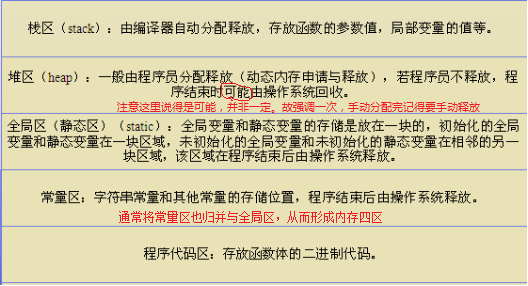
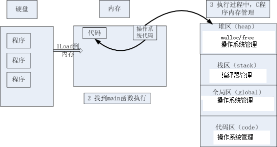
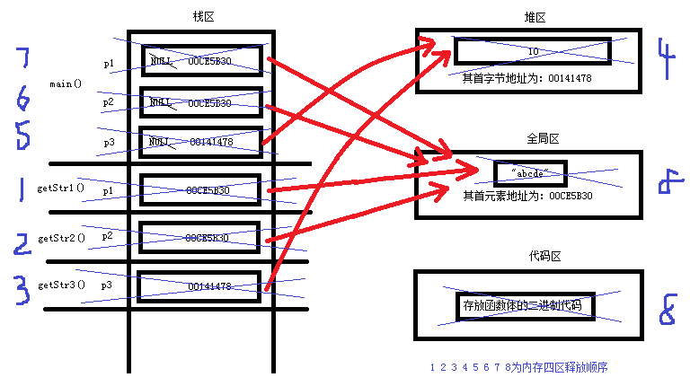
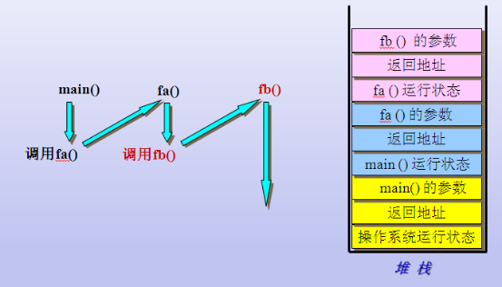
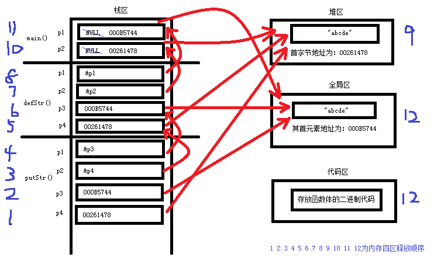

# C语言——内存四区专题

<br/>


<h2 id="0">目录</h2>
<br/>

* [1　数据类型的本质分析](#1数据类型的本质分析)
	* [1.1　数据类型的本质](#11数据类型的本质)
	* [1.2　数据类型大小的计算](#12数据类型大小的计算)
	* [1.3　数据类型别名](#13数据类型别名)
	* [1.4　关于void类型](#14关于void类型)
	* [1.5　关于数组类型](#15关于数组类型)
* [2　变量的本质分析](#2变量的本质分析)
* [3　内存四区模型](#3内存四区模型)
	* [3.1　内存四区的介绍](#31内存四区的介绍)
	* [3.2　内存四区的建立流程](#32内存四区的建立流程)
	* [3.3　内存四区的建立实例](#33内存四区的建立实例)
	* [3.4　堆栈的属性测试](#34堆栈的属性测试)
* [4　函数调用模型](#4函数调用模型)
	* [4.1　函数调用模型的基本原理](#41函数调用模型的基本原理)
	* [4.2　关于变量的的跨函数调用与变量的生命周期](#42关于变量的的跨函数调用与变量的生命周期)
* [总结](#总结)

<br/>


## 1　数据类型的本质分析
[回到目录](#0)

### 1.1　数据类型的本质
[回到目录](#0)

**数据类型的本质是固定内存大小的别名**

> 说明：数据类型的本质是是固定内存大小的别名。数据类型是可以理解为创造变量的模具，编译器根据数据类型预算对象（变量）分配的内存空间大小，C语言通过定义数据类型创建变量。


```c
int a;       //告诉C编译器分配4个字节的内存

int b[5];    //告诉C编译器分配20个字节的内存
printf_s("b:%p   b+1:%p   &b:%p   &b+1:%p\n", b, b+1, &b, &b+1);
//b代表的是数组首元素的地址，&b代表的是整个数组的地址
//b+1与b地址相差4个字节，&b+1与&b地址相差了20个字节

char *p = (char *)malloc(4);
//malloc()函数返回值类型是void *类型
printf_s("p:%p   p+1:%p   &p:%p   &p+1:%p\n", p, p + 1, &p, &p + 1);
//p代表的是4个字节的中首个字节内存空间的地址，&p代表的是4个字节内存块的地址
//所以p+1与p地址相差1个字节，&p+1与&p地址相差了4个字节
if (p != NULL)
{
	free(p);
	p = NULL;
}
//该动态内存位于堆区，得由程序员手动释放
```


### 1.2　数据类型大小的计算
[回到目录](#0)

**数据类型大小的计算：sizeof()，注意它是操作符而不是函数**


```c
//在Microsoft Visual Studio中（不同编译器可能结果不一定相同）
printf_s("整型类型占%d个字节\n", sizeof(int));                     //4
printf_s("短整型类型占%d个字节\n", sizeof(short int));             //2
printf_s("长整型类型占%d个字节\n", sizeof(long int));              //4
printf_s("浮点型类型占%d个字节\n", sizeof(float));                 //4
printf_s("双精度浮点型类型占%d个字节\n", sizeof(double));          //8
printf_s("字符型类型占%d个字节\n", sizeof(char));                  //1
printf_s("整型指针类型占%d个字节\n", sizeof(int *));               //4
printf_s("双精度浮点型指针类型占%d个字节\n", sizeof(double *));    //4
printf_s("字符型指针类型占%d个字节\n", sizeof(char *));            //4
```


### 1.3　数据类型别名 
[回到目录](#0)

**数据类型别名：tydef，数据类型是可以起别名的**
```c
typedef struct Student   //复杂数据类型的重命名
{
	char name;
	int age;
}St;

typedef double db;      //简单数据类型的重命名

void main()
{
	St st1;   //定义的struct Student类型
	db t;     //定义的是double类型
	.......
}
```


### 1.4　关于void类型
[回到目录](#0)

> ① void类型就是“无类型”；void *类型就是“无类型指针”，它可以指向任何类型数据
> ② void类型的用法：用来修饰函数返回值和参数，仅表示无返回值或参数
> ③ void *作为左值用于接收任意类型的指针，void *作为右值赋值给其它类型指针时需要强制类型转换
> ④ void *类型用法：用于数据类型的封装，典型的如内存操作函数memcpy和memset
> ⑤ C语言没有定义void究竟是多大内存的别名；void *类型占4个字节的内存

```c
//以上要点③的范例
char *p1 = NULL;
void *p2 = &p1;
char *p3 = (char *)malloc(sizoeof(char) * 20);   //malloc()函数返回值类型是void*类型

//以上要点④的范例
void * memcpy ( void * destination, const void * source, size_t num );
void * memset ( void * ptr, int value, size_t num );

//以上要点⑤的范例
void i;   //错误，void类型不可用于定义变量
void *p = NULL;   //正确，void *类型可用于定义变量
printf_s("%d  %d\n", sizeof(void), sizeof(void *));   //0,4
```

### 1.5　关于数组类型

[回到目录](#0)

-  ①数组是一种数据类型吗？


-  ②数组做函数参数的技术盲点和推演
关于问题②，主要是明白数组数据类型，数组指针类型，数组数据类型与数组指针类型之间的关系，以下我们通过一个例子来进行说明

```c
#include <stdio.h>

void output1Arr(char *a)
{
	printf_s("sizeof(a) = %d\n", sizeof(a));   
	//sizeof(a)=4，说明此处的形参a是数组指针
	//说明数组做函数参数传递时退化为一指针

	return;
}

int main(void)
{
	char a[5];
	printf_s("sizeof(a) = %d     sizeof(a[0] = %d\n", sizeof(a), sizeof(a[0]));   
	//sizeof(a)=5，sizeof(a[0])=1，说明此处的a是数组

	output1Arr(a); 

	return 0;
}

/*
在Microsoft Visual Studio中的运行结果是：
----------------------------------
sizeof(a) = 5     sizeof(a[0] = 1
sizeof(a) = 4
sizeof(a[5]) = 1
----------------------------------
要点：形参中的数组，C编译器会把它当成指针处理，这是C语言的特色
*/
```

<br/>


## 2　变量的本质分析

[回到目录](#0)

> ① 既能读又能写的内存对象称为变量；一旦初始化后不能修改的对象则称为常量（const）
> ② 变量名是（一段连续）内存空间的别名（可以看成是一个门牌号） 
> ③ 程序通过变量来申请内存空间，并通过变量名来命名和访问内存空间
> ④ 修改变量有两种方法：直接法和间接法（指针）
> ⑤ 数据类型与变量之间的关系：通过数据类型创建变量
```c
//以上要点④的范例
int a = 0;
a = 10;       //直接法修改变量
*(&a) = 20;   //间接法修改变量
```

<br/>


## 3　内存四区模型

[回到目录](#0)

### 3.1　内存四区的介绍
[回到目录](#0)  

**内存四区：堆区、栈区、全局区、代码区**



### 3.2　内存四区的建立流程

[回到目录](#0)  

**1、操作系统把物理硬盘代码load到内存**  

**2、操作系统找到main函数入口执行**  

**3、操作系统把代码分成四个区**



### 3.3　内存四区的建立实例

[回到目录](#0)

```c
#include <stdio.h>
#include <malloc.h>

char * getStr1()
{
	char * p1 = "abcde";
	return p1;
}

char * getStr2()
{
	char * p2 = "abcde";
	return p2;
}

int * getStr3()
{
	int * p3 = (int *)malloc(sizeof(char) * 4);   
	return p3;
}

int main()
{
	char * p1 = NULL;
	char * p2 = NULL;
	int * p3 = NULL;

	p1 = getStr1();
	p2 = getStr2();
	p3 = getStr3();
	*p3 = 10;

	printf_s("p1 = %s   p2 = %s   *p3 = %d\n", p1, p2, *p3);
	printf_s("p1 = %p   p2 = %p   p3 = %p\n", p1, p2, p3);

	if (p3 != NULL)
	{
		free(p3);
		p3 = NULL;
	}

	return 0;
}

/*
在Microsoft Visual Studio中的运行结果是：
----------------------------------
p1 = abcde   p2 = abcde   *p3 = 10
p1 = 00CE5B30   p2 = 00CE5B30   p3 = 00141478
----------------------------------
要点：
	按照栈区的“先入后出原则”，栈区局部变量的建立释放顺序：
	依次建立main()函数中的局部变量p1，p2，p3
	建立getStr1()函数中的局部变量p1、释放getStr1()函数中的局部变量p1
	建立getStr2()函数中的局部变量p2、释放getStr2()函数中的局部变量p2
	建立getStr3()函数中的局部变量p3、释放getStr3()函数中的局部变量p3
	手动释放main()函数中的局部变量p3所指向的动态内存空间（位于堆区）
	依次释放main()函数中的局部变量p3，p2，p1
```



### 3.4　堆栈的属性测试

[回到目录](#0)

- **堆区、栈区的开口方向是向上还是向下？**

```c
int a;
int b;
int *p1 = (int *)malloc(4);
int *p2 = (int *)malloc(4);
printf_s("&a:%p   &b:%p\n", &a, &b);
//测试栈区开口向上还是向下，可以根据&a与&b的大小来判断，
//&a比&b大则代表栈区开口向下，反之开口向上，
//测试出来后&a比&b大，一般认为栈是开口向下的
printf_s("p1:%p   p2:%p\n", p1, p2);
//测试堆区开口向上还是向下，可以根据p1与p2的大小来判断，
//p1比p2大则代表堆区开口向下，反之开口向上，
//测试出来后p1比p2小，一般认为堆区是开口向上的
if (p1!=NULL)
	{
		free(p1);
		p1 = NULL;
	}
if (p2!=NULL)
{
	free(p2);
	p2 = NULL;
}
```

- **数组数据类型在堆区、栈区的生长方向是朝上还是朝下？**
```c
char buf[12];
char *pArr = (char *)malloc(12 * sizeof(char));
printf_s("&buf[0]:%p   &buf[2]:%p\n", buf, buf+2);
printf_s("&pArr[0]:%p   &pArr[2]:%p\n", &pArr[0], &pArr[2]);
//buf+2始终比buf大2，&pArr[2]始终比&pArr[0]大2，
//说明数组的总是向上生长的，这与堆栈的开口方向无关
if (pArr!=NULL)
{
	free(pArr);
	pArr = NULL;
}
```

<br/>


## 4　函数调用模型

[回到目录](#0)

### 4.1　函数调用模型的基本原理
[回到目录](#0)



### 4.2　关于变量的的跨函数调用与变量的生命周期

[回到目录](#0)
我们通过下面这个例子来进行详细说明

```c
#include <stdio.h>
#include <string.h>
#include <malloc.h>

void putStr(char *p1, char *p2)
{
	char *p3 = p1;
	char *p4 = p2;
	strcpy(p4, p3);

	printf_s("p3:%p     p4:%p\n", p3, p4);
	printf_s("p3:%s     p4:%s\n", p3, p4);

	return;
}

void defStr(char **p1, char **p2)
{
	char *p3 = "abcde";
	char *p4 = (char *)malloc(sizeof(char) * 6);

	*p1 = p3;
	*p2 = p4;
	putStr(p3, p4);

	return;
}

void main()
{
	char *p1 = NULL;
	char *p2 = NULL;
	defStr(&p1, &p2);

	if (p2 != NULL)
	{
		free(p2);
		p2 = NULL;
	}

	return;
}

/*
在Microsoft Visual Studio中的运行结果是：
----------------------------------
p3:0084573C     p4:00821478
p3:abcde     p4:abcde
----------------------------------
要点：
```



**① 关于变量的跨函数调用：**
（注：此处的前级函数与本级函数，本级函数与后级函数是调用与被调用的关系）

| ********      |    前级函数 |   后级函数   |
| :--------: | :--------: | :------: |
| 某个函数在**栈区**申请的内存    |   不可以使用 |  可以使用  |
| 某个函数在**堆区**申请的内存    |   可以使用 |  可以使用  |
| 某个函数在**全局区**申请的内存    |   可以使用 |  可以使用  |

**② 关于变量的生命周期：**
某函数通过变量在栈区申请的内存在此函数结束时也就被释放了；通过变量在堆区申请的内存需要程序员手动进行释放；通过变量在全局区申请的内存在整个程序结束后被释放  

<br/>


## 总结

[回到目录](#0)

- 建立正确的**程序运行内存四区布局图**是学好C语言的关键，要点如下：  

  ① 正确使用内存四区模型&函数调用模型  

  ② 对于函数内部，深入理解数据数据类型和变量的内存属性  

  ③ 对于函数之间，分清主调函数分配内存还是被调函数分配内存  

  ④ 主调函数如何使用被调函数分配的内存，被调函数如何使用主调函数分配的内存（指针作函数参数，见4.2节中的例子）  

  ⑤ 关注通过变量申请的内存空间的生命周期
