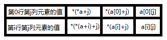
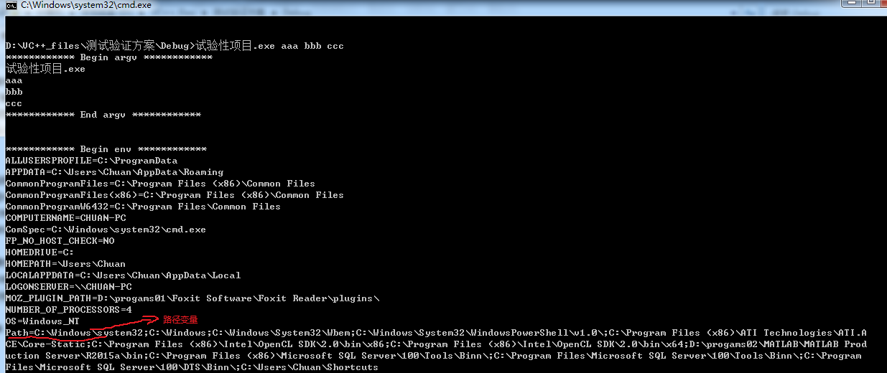

# C语言——数组专题


<h2 id="0">目录</h2>
<br/>


* [1　数组的基本概念](#1数组的基本概念)
* [2　搞清楚这两对概念很重要](#2搞清楚这两对概念很重要)
	* [2.1　数组类型、数组类型变量](#21数组类型数组类型变量)
	* [2.2　数组指针类型、数组指针类型变量](#22数组指针类型数组指针类型变量)
* [3　数组名的本质分析](#3数组名的本质分析)
	* [3.1　一维数组名](#31一维数组名)
	* [3.2　二维数组名](#32二维数组名)
* [4　数组作函数参数的退化问题](#4数组作函数参数的退化问题)
	* [4.1　一维数组](#41一维数组)
	* [4.2　二维数组](#42二维数组)
* [5　指针数组](#5指针数组)
	* [5.1　指针数组的应用场景](#51指针数组的应用场景)
	* [5.2　指针数组的自我结束能力](#52指针数组的自我结束能力)

<br/>


## 1　数组的基本概念

[回到目录](#0)

> ① 从元素的角度看，数组是具有相同类型的变量的有序集合；从内存的角度看，数组是连续的一片内存空间
> ② 关于数组的初始化元素的个数可以显示或隐式指定，比如：
> `int a[2] = {1,2}`和`int b[] = {1, 2}`
> ③ 将数组完全初始化为0的两种方案：
> `int c[3] = {0}   编译时就已确定所有值为0，此方案更快些`
> `int d[3]={1,2,3}; memset(d,0,sizeof(d));   显示重置内存块`
> ④ 数组首元素的地址和数组地址是两个不同的概念；但数组首元素的地址和数组的地址值相等。比如：int a[5]=0，a（数组首元素的地址）与&a（数组的地址）的值相等，但是a+1与a的值相差4，&a+1与&a的值相差4*5=20
> ⑤ 数组名代表数组首元素的地址，它是个常量，不可被修改！

<br/>


## 2　搞清楚这两对概念很重要

[回到目录](#0)
- **很重要的概念：数组类型、数组类型变量、数组指针类型、数组指针类型变量**


### 2.1　数组类型、数组类型变量
[回到目录](#0)
> 数组类型为int ()[len] 。数组类型变量是一个一级指针，可用于指向一维数组首元素。

- **定义数组类型变量：**
```c
//通过定义数组类型来定义数组类型变量
typedef int(myArrary)[5];
myArrary arrary;

//直接定义一个数组类型变量
int arrary[5];

//以上这两种方式等价
```

### 2.2　数组指针类型、数组指针类型变量

[回到目录](#0)
> 数组指针类型是在数组类型的基础上取指针，即int (*)[len]。数组指针类型变量是一个二级指针，可用于指向一个整个一维数组（或二维数组的首行）。

- **定义数组指针类型变量有以下三种方式：**

① 通过定义数组类型定义数组指针变量
```c
//通过定义数组类型定义数组指针变量
typedef int (myArrary)[5];
myArrary *pArrary;

int a[3] = {1, 4, 3};
int b[2][3] = {0};

pArrary = &a;
(*pArrary)[1] = 2;   //等价于a[1] = 2
pArrary = b;
pArrary[1][2] = 6;   //等价于b[1][2] = 6
```

② 通过数组指针类型来定义数组指针类型变量
```c
//通过数组指针类型来定义数组指针类型变量
typedef int (*myArrary)[5];
myArrary pArrary;

int a[3] = {1, 4, 3};
int b[2][3] = {0};

pArrary = &a;
(*pArrary)[1] = 2;   //等价于a[1] = 2
pArrary = b;
pArrary[1][2] = 6;   //等价于b[1][2] = 6
```

③ 直接定义数组指针类型变量
```c
//直接定义数组指针类型变量
//pArrary为数组指针变量名，int为指向的数组的类型，5为指向的数组的长度
int (*pArrary)[5];

int a[3] = {1, 4, 3};
int b[2][3] = {0};

pArrary = &a;
(*pArrary)[1] = 2;   //等价于a[1] = 2
pArrary = b;
pArrary[1][2] = 6;   //等价于b[1][2] = 6
```

<br/>


## 3　数组名的本质分析

[回到目录](#0)

### 3.1　一维数组名
[回到目录](#0)

对于int buf[5]
b（一级指针）代表一维数组首元素的地址，b+1相当于指针后移4个字节
&b（二级指针）代表整个一维数组的地址，&b+1相当于指针后移4*10个字节
故一维数组名的本质是指向一维数组首元素的一级指针

| int buf[5]| |  | |   |
| :-------- | :--------| :-------- | :-------- | :-------- |
| 数组首元素   |   buf[0] |  *buf  |数组首元素地址   |&buf[0]   |buf   |
|数组末元素  |buf[4]  |*(buf+4)   | 数组末元素地址  |  &buf[4] | buf+4 |


### 3.2　二维数组名
[回到目录](#0)

对于int a[3][5]
a（二级指针）代表二维数组首行的地址，a+1相当于指针后移4*5个字节
&a（三级指针）代表整个二维数组的地址，&a+1相当于指针后移4*3*5个字节
故二维数组名的本质是指向二维数组首行（即是一个一维数组）的二级指针

| int a[3][5]| | |  | |   |
| :-------- | :--------| :-------- | :-------- | :-------- |
| 第0行的地址    |   a |  &a[0]  |第i行的地址     |a+i   |&a[i]  |
|第0行首元素的地址|*a|&a[0][0]|第i行首元素的地址|*(a+i)|&a[i][0]|
|第0行第j列的地址|*a+j|&a[0][j]|第i行第j列的地址|*(a+i)+j|&a[i][j]|



<br/>


## 4　数组作函数参数的退化问题

[回到目录](#0)

### 4.1　一维数组
[回到目录](#0)
一维数组名的本质是指向一维数组首元素的一级指针，故一维数组作函数参数退化为一级指针。
```c
void printArr1(int pArrary[3])      
{.....}
//一维数组作函数参数退化为一级指针，传递来的是一维数组首元素的地址，并非拷贝数据
//退化过程：int pArrary[3]--->int pArrary[]--->int *pArrary
void printArr2(int *pArrary)        //一级指针
{.....}
void printArr3(int (*pArrary)[3])   //二级指针
{.....}

void main()
{
	int a[3] = {1, 2, 3};
	printArr1(a);
	printArr2(a);
	printArr2(&a);
}
```

### 4.2　二维数组
[回到目录](#0)
二维数组名的本质是指向二维数组首行（即是一个一维数组）的二级指针，故二维数组作函数参数退化为二级指针。

```c
void printArr1(int pArrary[2][3])   
{.....}
//二维数组作函数参数退化为二级指针，传递来的是二维数组首行的地址，并非拷贝数据
//退化过程：int pArrary[2][3]--->int pArrary[][3]--->int (*pArrary)[3]
void printArr2(int (*pArrary)[3])   //二级指针
{.....}

void main()
{
	int a[2][3] = {{1, 2, 3}, {4, 5, 6}};
	printArr1(a);
	printArr2(a);
}
```
二维数组（多维数组）的数据是线性存储的
证明方式一：将二维数组当成一维数组线性打印，来证明二维数组是线性存储的
```c
#include <stdio.h>

void printArr(int *a, int num)
{
	int i;

	for(i=0; i<num; i++)
		printf_s("%d ", a[i]);
	printf_s("\n");
}

void main()
{
	int a[2][3] = {{1, 2, 3}, {4, 5, 6}};

	printArr((int *)a, 6);
}

/*在Microsoft Visual Studio中的运行结果是：
---------------------------------------
1 2 3 4 5 6
---------------------------------------*/
```
证明方式二：依次按行输出二维数组元素的地址，检查是否依次排列的
```c
#include <stdio.h>

void main()
{
	int a[2][3] = {{1, 2, 3}, {4, 5, 6}};
	int i, j;

	for (i=0; i<2; i++)
	{
		for (j=0; j<3; j++)
			printf_s("&a[%d][%d]:%p  ", i, j, &a[i][j]);
		printf_s("\n");
	}
}

/*在Microsoft Visual Studio中的运行结果是：
---------------------------------------
&a[0][0]:0034F9D0  &a[0][1]:0034F9D4  &a[0][2]:0034F9D8
&a[1][0]:0034F9DC  &a[1][1]:0034F9E0  &a[1][2]:0034F9E4
---------------------------------------*/
```

<br/>


## 5　指针数组

[回到目录](#0)

| 数组参数      |     等效的指针参数 |
| :-------- | :--------|
| 一维数组 char a[30]	    |  指针 char* |
|二维数组 char a[10][30]		    |  数组的指针 char (*a)[30] |
|指针数组 char *a[30]			    |  指针的指针 char **a |

### 5.1　指针数组的应用场景
[回到目录](#0)

- **应用场景一：做菜单**
```c
#include <stdio.h>
#include <string.h>
#define DIM(a) (sizeof(a)/sizeof(*a))   //带参数的宏定义
//这个指令告诉C 预处理器把所有的DIM(a)替换为sizeof(a)/sizeof(*a)

void searchKeyTable(const char **, const int, const char *, int *);

void main()
{
	int iNum = 0, pos = 0;
	char *c_keyword[] = {"while", "case", "static", "do"};

	iNum = sizeof(c_keyword) / sizeof(*c_keyword);   // 16/4=4，此处的c_keyword代表数组

	searchKeyTable(c_keyword, DIM(c_keyword), "do", &pos);
	//在预编译阶段，对DIM(c_keyword)进行文本替换：sizeof(c_keyword)/sizeof(*c_keyword)
	printf_s("pos:%d \n", pos);

	return;
}

void searchKeyTable(const char *table[], const int size, const char *key, int *pos)
{	//const char *table[] <====> const char **table
	int iNum = 0, i = 0;

	if (table==NULL || key==NULL || pos==NULL)
	{
		printf_s("func searchKeyTable() err:table==NULL || key==NULL || pos==NULL \n");
		return;
	}

	iNum = sizeof(table) / sizeof(*table);   // 4/4=1，此处的table是二级指针

	for (i=0; i<size; i++)
	{
		if ( strcmp(table[i], key) == 0 )
		{
			*pos = i;
			break;
		}	
	}
	if (i == size)
		printf_s("没找到菜单关键词！ \n");

	return;
}

//以上程序通过检查关键字符串的标号实现做菜单
```

- **应用场景二：做命令行**
```c
#include <stdio.h>

void main(int argc, char *argv[], char **env)
{	
	//此处argv，env所分配的内存空间来自何方？这很重要
	//此处的内存空间由操作系统分配的！由操作系统拉起用于应用程序
	int i = 0;

	//以下为命令行命令，往应用程序里挂数据，argc表示所挂数据的数量
	printf_s("************ Begin argv ************ \n");
	for (i=0; i<argc; i++)
		printf_s("%s \n", argv[i]);
	printf_s("************ End argv ************ \n");

	printf_s("\n");
	printf_s("\n");
	
	//以下输出操作系统环境变量
	printf_s("************ Begin env ************ \n");
	for (i=0; env[i]!=NULL; i++)
		printf_s("%s \n", env[i]);
	printf_s("************ End env ************ \n");

	printf_s("\n");
	printf_s("\n");

	return;
}

//此程序用于往应用程序里挂数据和输出操作系统环境变量
//这个程序也告诉我们写应用程序开发，一定要清楚所分配的内存来自何处
//比如这个程序所分配的内存来自操作系统，所以一定要清楚自己在什么框架下做开发
```


### 5.2　指针数组的自我结束能力
[回到目录](#0)
**对于指针数组的打印输出何时才能自我结束，一般由两种方式：**
**一是**知道指针数组的长度，比如`char *buf[3] = {"aaa","bbb","ccc"}`，在输出打印时，自我结束方法是`for (i=0;i<3;i++) print()....`
然而我们在编写程序定义指针数组时往往需要花费精力去确定指针数组的长度，这显然是低效的；
**二是**在指针数组中添加字符数组自我结束标志NULL 或 0 或'\0'，这种情况可以不知道指针数组的长度，比如`char *buf[] = {"aaa","bbb","ccc",'\0'}`或者`char *buf[] = {"aaa","bbb","ccc",0}`或者`char *buf[] = {"aaa","bbb","ccc",NULL}`，在输出打印时，自我结束方法是`for (i=0;buf[i]!=NULL;i++) print()....`

