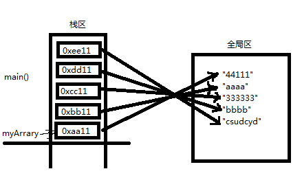
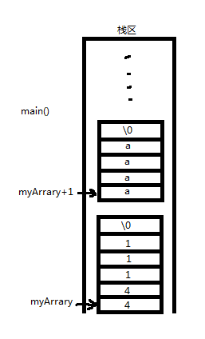
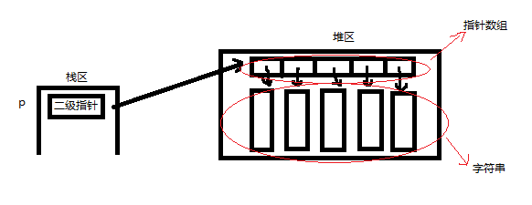

# C语言——指针专题

<br/>


<h2 id="0">目录</h2>  
<br/>

* [1　指针也是一种数据类型](#1指针也是一种数据类型)
* [2　间接赋值是指针存在的最大意义](#2间接赋值是指针存在的最大意义)
* [3　理解指针必须和内存四区概念相结合](#3理解指针必须和内存四区概念相结合)
* [4　一级指针专题](#4一级指针专题)
	* [4.1　一级指针的输入输出模型](#41一级指针的输入输出模型)
    * [4.2　一级指针的易犯错模型](#42一级指针的易犯错模型)
* [5　二级指针](#5二级指针)
	* [5.1　二级指针的三种输入模型](#51二级指针的三种输入模型)
		* [5.1.1　指针数组](#511指针数组)
        * [5.1.2　二维数组](#512二维数组)
        * [5.1.3　自定义内存分配模式](#513自定义内存分配模式)
        * [5.1.4　二级指针三种输入模型的综合应用](#514二级指针三种输入模型的综合应用)
	* [5.2　二级指针的输出模型](#52二级指针的输出模型)


<br/>


## 1　指针也是一种数据类型
[回到目录](#0)

> ① 指针也是一种变量，占有4个字节内存空间，用来保存内存地址
> ② 关于*p
　　在指针声明时，*p表示所声明的变量为指针
　　在指针使用时，*p表示操作指针所指向的内存空间
　　*p放在等号的左边（给内存赋值）
　　*p放在等号的右边（从内存获取值）
> ③ 指针变量和它指向的内存块是两个不同的概念  
　　给p赋值p=0x1111，只会改变指针变量的值，不会改变所指内存块的值
　　给*p赋值*p='a'，只会改变所指的内存块的值，不会改变指针变量的值
> ④ 指针是一种数据类型，是它指向的内存空间的数据类型
　　p++ = p + sizeof(a)
> ⑤ 把谁的地址赋值给指针则指针就指向谁，但随意改变指针指向要提防野指针问题

```c
//野指针问题
p1 = (char *)malloc(10);
if (p1 != NULL)
{
	free(p1);  
	p1 = NULL; 
	//指针变量和它所指向的内存空间是两个不同的概念
	//此处释放了指针变量p1所指向的内存空间，但指针变量p1本身未变，这会使得p1变成野指针
	//所谓野指针，是指不能再往该指针指向的内存空间里写数据，也不能再一次释放该指针指向的内存空间
	//而为了避免野指针问题，在释放了指针变量p1所指向的内存空间后，必须将p1重置为NULL	
}
```

<br/>


## 2　间接赋值是指针存在的最大意义

[回到目录](#0)
> ① *p间接赋值成立的3个条件：
　　a) 2个变量；b) 一个变量取地址传给另一个变量 ；c) *p间接修改值
> ② 改变0级指针的值有2种方式（直接修改、1级指针间接修改）
　　改变n-1级指针的值有2种方式（直接修改、n级指针间接修改）
> ③ 函数调用时，用实参取地址传给形参，在被调用函数里用*p来间接修改实参
> ④ 函数是枪管，指针是子弹，两者结合就是C语言的精华。

```c
#include <stdio.h>
#include <string.h>
#include <malloc.h>

//指针做输出，即在子函数中分配内存，主函数使用
void getMem(char ** myp1/*out*/, int * mylen1/*out*/, char ** myp2/*out*/, int * mylen2/*out*/)
{
	char * temp1, *temp2;
	
	temp1 = (char *)malloc(8);
	temp2 = (char *)malloc(10);
	strcpy_s(temp1, 6, "abcde");
	strcpy_s(temp2, 8, "1234567");

	//通过二级指针myp1,myp2间接改变一级指针p1,p2的值
	*myp1 = temp1;
	*myp2 = temp2;
	//通过一级指针mylen1,mylen2间接改变零级指针len1,len2的值
	*mylen1 = strnlen(temp1);  
	*mylen2 = strnlen(temp2);
	
	return;
}

void main()
{
	char * p1 = NULL;
	int len1 = 0;
	char * p2 = NULL;
	int len2 = 0;

	getMem(&p1, &len1, &p2, &len2);

	printf_s("p1:%s   len1:%d\n", p1, len1);
	printf_s("p2:%s   len2:%d\n", p2, len2);

	if (p1 != NULL)
	{
		free(p1); 
		p1 = NULL;  
	}
	if (p2 != NULL)
	{
		free(p2); 
		p2 = NULL;
	}

	return;
}

/*
在Microsoft Visual Studio中的运行结果是：
---------------------------------------------
p1:abcde   len1:5
p2:1234567   len2:7
---------------------------------------------
要点：
```

<br/>


## 3　理解指针必须和内存四区概念相结合 

[回到目录](#0)
- **关于申请内存的跨函数操作**
主调函数在栈区、堆区、全局区申请的内存可让被调函数进行操作；被调函数在堆区、全局区申请的内存可被主调函数操作，但在栈区申请的内存不可被主调函数操作。
- **内存分配方式**
指针作函数参数是有输入输出特性的，其输入输出特性取决于内存分配方式。判断关键是主调函数分配内存还是被调函数分配内存。

<br/>


## 4　一级指针专题

[回到目录](#0)

### 4.1　一级指针的输入输出模型
[回到目录](#0)
> 理解：一级指针作的输入模型是指主调函数在栈区、堆区、全局区分配内存，通过指 针作函数参数传递在被调函数里跨函数操作此块内存；一级指针作的输出模型是指被调函数分配内存，在被调函数操作此块内存。

- **一级指针作输入**
```c
//应用场合一：打印字符串
void showbuf(char *p/*in*/)   
{
	printf_s("p:%s\n", p);

	return;
}

void main()
{
	char buf[] = "abcde";
	showbuf(buf);

	return;
}

//应用场合二：打印数组
void showArray(int *array/*in*/, int iNum/*in*/)   
```

- **一级指针作输出**
```c
//应用场合：子函数分配内存将jieg
void getLen(char *p/*out*/)
{
	char *str = "abcde";

	*p = strlen(str);

	return;
}

void main()
{
	int len = 0;
	getLen(&len);
	
	return;
}
```

### 4.2　一级指针的易犯错模型
[回到目录](#0)  
 **1　字符串作函数参数出错模型分析**

```c
void f(char *p1, char *p2)
{
	printf_s("p1:%s \n", p1);     //读取受保护的内存空间，结果是：(null)
	printf_s("p2:%s \n", p2);     //读取全局区的内存空间，结果是：abcd
	printf_s("%c \n", *p1);       //读取错误，出现宕机！那么
	printf_s("%c \n", *p2);       //读取结果：a
	//通过*p1, *p2间接改写那是绝对不可取的！
	//由以上读取字符串首元素的区别可知，NULL和全局区的所代表内存空间显然有区别！
	//故强烈在此建议，在子函数中，无论哪处都不建议出现*p1的字样，比如出现
	//if (*p1 == '0')
	
	return;
}

void main()
{
	char *p1 = NULL;    //等价于char *p = 0;
	char *p2 = "abcd";
	
	f(p1, p2);

	return;
}
```

 **2　向外传递子函数在栈区申请的内存**

```c
char *a = malloc(10);
for (i=0; i<10; i++)
{
	*a = i;
	a++;
}
free(a);   //a都指到哪里去了，你还随便释放？
```

 **3　向外传递子函数在栈区申请的内存**

```c
char *str_cat(char *x, char* y)  //此函数用于连接两个字符串
{
	char str[20];
	char *z = str; 	
	while(*z++ = *x++);   //执行顺序： *z=*x;  z++;x++; 判断表达式"*z=*x"是否为0
	z--;	   //此处亮点：覆盖字符串结尾标志符
	while(*z++ = *y++);
	z = str;		 
	return z;   //向外传递子函数在栈区申请的内存？
	//如果一定要向外传递的话，那么子函数的内存需要在堆区申请，不可在栈区申请
}
```

 **4　关于取地址与累加的顺序**

```c
void f(int *count)
{
	int i = 0;

	for (i=0; i<5; i++)
	{
		*count++;
		//等价于： *count; count++;  
		//然而这样count的地址已经变了，又怎么间接改变main函数中的count的值呢? 

		(*count)++;   //这才是正确的做法，实现count间接改变值，不断加1
	}
	
	return;
}
```

 **5　关于const指针的小问题**

```c
//1 const 指针
const char *p1 = NULL;   
//指针p所指向的内存空间不能修改，但p本身可以被修改
char * const p2 = NULL;
//指针p本身不能被修改，但p所指向的内存空间可以被修改
const char * const p3 = NULL;
//指针p本身和p所指向的内存空间都不能被修改

//2 const 整型
const int a = 10;   //变量a不可被直接修改，与"int const a = 10;"含义相同
//然而变量a却可以被间接修改，故const在C语言中是个伪命题
int *t = &a;
*t = 20;
printf_s("a:%d \n", a);   //结果是20
```

<br/>


## 5　二级指针

[回到目录](#0)

### 5.1　二级指针的三种输入模型
[回到目录](#0)

#### 5.1.1　指针数组
[回到目录](#0)
> 所谓指针数组，即数组所存元素皆为指针，显然指针数组的数组名必然是多级指针。例如，`char *myArrary[5] = {"44111", "aaaa", "333333", "bbbb", "csudcyd"}` 显然指针数组所存储的元素为一级指针（即各字符串的地址），指针数组的数组名则为二级指针。

- **举例一个字符串的排序来说明指针数组作函数参数的用法**
```c
#include <stdio.h>
#include <string.h>

void sortStr(char **, int);
void printStr(char **, int);

void main()
{
    char *myArrary[5] = {"44111", "aaaa", "333333", "bbbb", "csudcyd"}; 
    //该指针数组存储的是一级指针，即各字符串的地址，并非字符串所在内存块  
    int len = sizeof(myArrary) / sizeof(myArrary[0]);   //20/4=5

    sortStr(myArrary, len);
    printStr(myArrary, len);

    return;
}

void sortStr(char **myArrary, int len)
{   //函数功能：选择排序法实现字符串从小到大排序
    char *temp = NULL;
    int i = 0, j = 0;

	if (myArrary == NULL)
	{
		printf_s("func sortStr() err:myArrary == NULL \n");
		return;
	}

    for (i=0; i<len; i++)
    {
        for (j=i; j<len; j++)
        {
            if ( strcmp(myArrary[i], myArrary[j]) > 0 )
            {
                //此处交换的是指针数组的元素，并非交换字符串所在内存块
                temp = myArrary[i];
                myArrary[i] = myArrary[j];
                myArrary[j] = temp;
            }
        }
    }

    return;
}

void printStr(char **myArrary, int len)
{	//函数功能：挨个打印字符串
    int i = 0; 

	if (myArrary == NULL)
	{
		printf_s("func printStr() err:myArrary == NULL \n");
		return;
	}

    for (i=0; i<len; i++)
        printf_s("%s \n", myArrary[i]);

    return;
}

/*在Microsoft Visual Studio中的运行结果是：
------------------------------------------
333333
44111
aaaa
bbbb
csudcyd
------------------------------------------*/
```
- **关于指针数组在内存四区中的模型图**  



#### 5.1.2　二维数组
[回到目录](#0)

- **关于二维数组在内存四区中的模型图**  
例如，`char myArrary[5][10] = {"44111", "aaaa", "333333", "bbbb", "csudcyd"}` 该二维数组存储了多个字符串


- **举例一个字符串的排序来说明二维数组作函数参数的用法**     

  数组作函数参数会退化为指针，一维数组作函数参数会退化为一级指针，二维数组作函数参数会退化为二级指针。至于具体二维数组的本质以及二维数组作函数参数的用法会在数组专题中进行详细说明。
```c
#include <stdio.h>
#include <string.h>

void sortStr(char **, int);
void printStr(char**, int);

void main()
{
	char myArrary[5][10] = {"44111", "aaaa", "333333", "bbbb", "csudcyd"};  
	//该二维数组存储的是各个字符串
	int len = sizeof(myArrary) / sizeof(myArrary[0]);   // 50/10=5

	sortStr(myArrary, len);
	printStr(myArrary, len);

	return;
}

void sortStr(char myArrary[5][10], int len)
{	//函数功能：选择排序法实现字符串从小到大排序
	char temp[10] = {0};
	int i = 0, j = 0;

	for (i=0; i<len; i++)
	{
		for (j=i; j<len; j++)
		{
			if ( strcmp(myArrary[i], myArrary[j]) > 0 )
			{
				//此处时交换neicun
				strcpy(temp, myArrary[i]);
				strcpy(myArrary[i], myArrary[j]);
				strcpy(myArrary[j], temp);
			}
		}
	}

	return;
}

void printStr(char myArrary[5][10], int len)
{	//函数功能：挨个打印字符串
	int i = 0; 

	for (i=0; i<len; i++)
	{
		printf_s("%s \n", myArrary[i]);
	}

	return;
}

/*在Microsoft Visual Studio中的运行结果是：
------------------------------------------
333333
44111
aaaa
bbbb
csudcyd
------------------------------------------*/
```


#### 5.1.3　自定义内存分配模式
[回到目录](#0)
- **关于自定义内存分配模式，从内存四区图理解设计如下：**


- **举例一个字符串的排序来说明自定义内存分配模式的用法**
```c
#include <stdio.h>
#include <string.h>
#include <malloc.h>

void getBuf(char ***, int);    
void sortStr(char **, int);     
void printStr(char **, int);
void freeBuf(char *** ,int);

void main()
{
	char **p = NULL;
	int num = 5;

	getBuf(&p, num);

	printf_s("排序之前： \n");
	printStr(p, num);

	sortStr(p, num);

	printf_s("排序之后： \n");
	printStr(p, num);

	freeBuf(&p, num);

	return;
}

void getBuf(char ***myp, int num)
{   //函数功能：自己设计的内存分配模式
	int i = 0;
	char **p = NULL;
	int ret = 0;

	if (myp == NULL)
	{
		printf_s("func getBuf() err:myp == NULL \n");
		return;
	}

	//在堆区申请内存空间
	p = (char **)malloc(sizeof(char *) * num);
	if (p == NULL)
	{
		ret = -1;
		printf_s("func getBuf() err:malloc(sizeof(char *) * num) \n");
		goto END;   //当堆区申请一级内存出现错误时，保证申请的错误空间得以释放
	}
	memset(p, 0, sizeof(char *) * num);   //将堆区的一级内存进行初始化

	for (i=0; i<num; i++)
	{
		p[i] = (char *)malloc(sizeof(char) * num);
		if (p[i] == NULL)
		{
			ret = -1;
			printf_s("func getBuf() err:malloc(sizeof(char) * num) \n");
			goto END;   //当堆区申请二级内存出现错误时，保证申请的错误空间得以释放
		}
		sprintf(p[i], "%d%d%d", i+1, i+1, i+1);
	}

END:   //堆区内存分配出现错误时统一处理的接口
	if (ret != 0)  //失败
		freeBuf(&p , num);
	else           //成功
		*myp = p;

	return;
}

void sortStr(char **p, int num)
{	//函数功能：冒泡排序法实现字符串从小到大排序
	int i = 0, j = 0;
	char *temp = NULL;
	//char temp1[5];

	for (i=0; i<num; i++)
	{
		for (j=0; j<num-i-1; j++)
		{
			//1 交换指针
			if ( strcmp(p[j], p[j+1]) < 0 )
			{
				temp = p[j];
				p[j] = p[j+1];
				p[j+1] = temp;
			}

			//2 交换内存块
			/*if ( strcmp(p[j], p[j+1]) < 0 )
			{
				strcpy(temp1, p[j]);
				strcpy(p[j], p[j+1]);
				strcpy(p[j+1], temp1);
			}*/
		}
	}

	return;
}

void printStr(char **p, int num)
{	//函数功能：打印字符串
	int i = 0;
	for (i=0; i<num; i++)
	{
		printf_s("%s   ", p[i]);
	}
	printf_s("\n");

	return;
}

void freeBuf(char ***p ,int num)
{	//函数功能：释放在堆区申请的内存空间
	int i = 0;
	char **temp = *p;

	if (p == NULL)
	{
		printf_s("func getBuf() err:p == NULL \n");
		return;
	}

	//在堆区分配一级内存（即存储指针数组的内存块）出现错误
	if (temp == NULL)   
		return;

	//在堆区分配二级内存（即存储字符串的内存块）出现错误
	for (i=0; i<num; i++)
	{
		if (temp[i] != NULL)
		{
			free(temp[i]);
			temp[i] = NULL;
		}
	}
	if (temp != NULL)
	{
		free(temp);
		*p = NULL;   //通过指针间接赋值把实参置成NULL
	}

	return;
}

/*在Microsoft Visual Studio中的运行结果是：
------------------------------------------
排序之前：
111   222   333   444   555
排序之后：
555   444   333   222   111
------------------------------------------*/
```

#### 5.1.4　二级指针三种输入模型的综合应用
[回到目录](#0)

> 应用场合：将二级指针的第一种输入模型（指针数组）`char *p1[] = {"2222", "1111111", "33333"}`和第二种输入模型（二维数组）`char p2[4][10] = {"bbbbb", "aaaa", "cccccc", "zzz"}`中的字符串拷贝到二级指针的第三种输入模型（自定义内存模式）中，并进行排序输出

```c
#include <stdio.h>
#include <malloc.h>
#include <string.h>

/*把二级指针的第一种和第二种内存输入模型的内容copy到第三种内存输入模型中，
并在第三种内存输入模型中排序并打印*/

void copyStr(char ***, char **, int, char **, int);
void sortStr(char **, int, int);
void printStr(char **, int, int);
void freeStr(char ***, int, int);

void main()
{	
	char *p1[] = {"2222", "1111111", "33333"};
	char p2[4][10] = {"bbbbb", "aaaa", "cccccc", "zzz"};
	char **p3 = NULL;
	int num1 = 0, num2 = 0;
	
	num1 = sizeof(p1)/sizeof(p1[0]);
	num2 = sizeof(p2)/sizeof(p2[0]);

	copyStr(&p3, p1, num1, p2, num2);

	printf_s("排序之前 \n");
	printStr(p3, num1, num2);

	sortStr(p3, num1, num2);

	printf_s("排序之后 \n");
	printStr(p3, num1, num2);

	freeStr(&p3, num1, num2);

	return;
}

void copyStr(char ***p /*out*/, char **p1 /*in*/, int num1, char (*p2)[10] /*in*/, int num2)
{
	char **temp = NULL;
	int ret = 0, len = num1+num2, i = 0, size = 0;

	if (p == NULL || p1==NULL || p2==NULL)
	{
		ret = -1;
		printf_s("func createStr() err:%d, p == NULL || p1==NULL || p2==NULL \n", ret);
		return;
	}

	//1 分配二级指针所指向的内存
	temp = (char **)malloc(sizeof(char *) * len);
	if (temp == NULL)
	{
		ret = -2;
		goto END;
		return;
	}
	memset(temp, 0, sizeof(char *) * len);

	//2 分配一级指针所指向的内存
	for (i=0; i<len; i++)
	{
		if (i < num1)
		{
			size = strlen(p1[i]) + 1;   //注意多出一个字节来存储'\0'
			temp[i] = (char *)malloc(sizeof(char) * size);   //精确分配每一字节的空间来存储字符串
			if (temp[i] == NULL)
			{
				ret = -3;
				goto END;
				return;
			}
			memset(temp[i], 0, sizeof(char) * size);
			strcpy(temp[i], p1[i]);
		}	
		else
		{
			size = strlen(p2[i-num1]) + 1;   //注意多出一个字节来存储'\0'
			temp[i] = (char *)malloc(sizeof(char) * size);   //精确分配每一字节的空间来存储字符串
			if (temp[i] == NULL)
			{
				ret = -3;
				goto END;
				return;
			}
			memset(temp[i], 0, sizeof(char) * size);
			strcpy(temp[i], p2[i-num1]);
		}
	}
	
END:
	if (ret != 0)
		freeStr(&temp, num1, num2);
	else
		*p = temp;

	return;
}

void sortStr(char **p /*in*/, int num1, int num2)
{
	int ret = 0, len = num1+num2, i = 0, j = 0;
	char *temp = NULL;

	if (p == NULL)
	{
		ret = -1;
		printf_s("func copyStr() err:%d, p == NULL \n", ret);
		return;
	}

	for (i=0; i<len; i++)
	{
		for (j=0; j<len-i-1; j++)
		{
			if ( strcmp(p[j], p[j+1]) > 0)
			{
				temp = p[j];
				p[j] = p[j+1];
				p[j+1] = temp;
			}
		}
	}

	return;
}

void printStr(char **p /*in*/, int num1, int num2)
{
	int ret = 0, len = num1+num2, i = 0;

	if (p == NULL)
	{
		ret = -1;
		printf_s("func printStr() err:%d, p == NULL \n", ret);
		return;
	}

	for (i=0; i<len; i++)
	{
		printf_s("%-10s", p[i]);
	}
	printf_s("\n");

	return;
}

void freeStr(char ***p  /*out*/, int num1, int num2)
{
	int ret = 0, len = num1+num2, i = 0;
	char **temp = *p;

	if (p == NULL)
	{
		ret = -1;
		printf_s("func printStr() err:%d, p == NULL \n", ret);
		return;
	}

	if (temp == NULL)
		return;

	//1 释放一级指针所指向的内存
	for (i=0; i<len; i++)
	{
		if (temp[i] != NULL)
		{
			free(temp[i]);
			temp[i] = NULL;
		}
	}

	//2 释放二级指针所指向的内存
	if (temp != NULL)
	{
		free(temp);
		*p = NULL;
	}

	return;
}

/*在Microsoft Visual Studio中的运行结果是：
------------------------------------------
排序之前
2222      1111111   33333     bbbbb     aaaa      cccccc    zzz
排序之后
1111111   2222      33333     aaaa      bbbbb     cccccc    zzz
-----------------------------------------*/
```


### 5.2　二级指针的输出模型
[回到目录](#0)
> 二级指针作输出的内存模型，即在子函数中分配内存，然后通过二级指针甩出给main函数，典型就像以下形式：

```c
void getStr(char **p)
{
	char *temp = (char *)malloc(sizeof(char) * 8);

	strcpy(temp, "abcde");
	*p = temp;

	return;
}

void main()
{
	char *p = NULL;

	getStr(&p);
	//后续：打印字符串，释放堆区内存略

	return;
}
```


