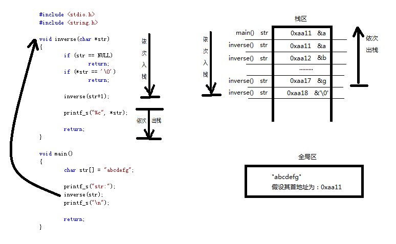
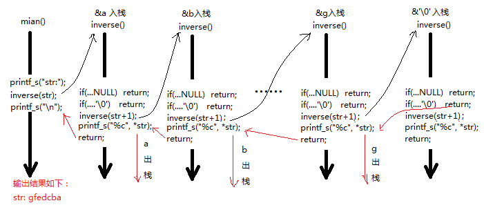

# C语言——字符串项目开发模型

<br/>


<h2 id="0">目录</h2>
<br/>


* [1　strCount模型](#1strcount模型)
* [2　首尾去空格模型](#2首尾去空格模型)
* [3　去所有空格模型](#3去所有空格模型)
* [4　字符串反转模型](#4字符串反转模型)
	* [4.1　指针传递法](#41指针传递法)
	* [4.2　递归逆序法](#42递归逆序法)

<br/>


## 1　strCount模型
[回到目录](#0)
> 案例概述：求字符串 char *p = "11abcd25abcd2j" 中子字符串 "abcd" 出现的次数。请自定义函数接口完成上述需求。

```c
#include <stdio.h>
#include <string.h>

int strCount(char *myStr/*in*/, char *myBuf/*in*/, int *myCount/*in*/)
{
	int ret = 0;

	if (myStr==NULL || myBuf==NULL || myCount==NULL)
	{
		ret = -1;
		printf_s("func strCount() err: myStr==NULL || myBuf==NULL || count==NULL\n");

		return ret;
	}

	while (myStr = strstr(myStr, myBuf))
	{
		(*myCount)++;
		myStr = myStr + strlen(myBuf);
		if (*myStr == '\0')
			break;
	}

	return ret;
}

void main()
{
	char *str = "11abcd25abcd";
	char *buf = "abcd";
	int count = 0;
	int ret = 0;

	ret = strCount(str, buf, &count);
	if (ret != 0)
		printf_s("func strCount() err: %d\n", ret);

	printf_s("count:%d\n", count);

	return;
}

/*
在Microsoft Visual Studio中的运行结果是：
---------------------------------------------
count:2
---------------------------------------------
要点：
```

<br/>


## 2　首尾去空格模型

[回到目录](#0)
> 案例概述：有一个字符串开头或结尾含有n个空格（"       abcdefgdddd    "），欲去掉前后空格，返回一个新字符串。请自定义函数接口完成上述需求。

- **法一：用一个数组用来接收新的字符串（去首尾空格）**
```c
#include <stdio.h>
#include <string.h>

int trimSpace(char *inbuf, char *outbuf)
{
	int len = strlen(inbuf);
	char *start = inbuf;
	char *end = start + len -1;
	int count = 0;
	int ret = 0;

	if (inbuf==NULL || outbuf==NULL)
	{
		ret = -1;
		printf_s("func trimSpace() err:inbuf==NULL || outbuf==NULL\n");
	}

	while (*start && *start==' ')
		start++;
	while (*end && *end==' ')
		end--;
	
	count = end-start+1;
	strncpy(outbuf, start, count);
	outbuf[count] = '\0';

	return ret;
}

void main()
{
	char *inbuf= "       abcdefgdddd    ";   
	char outbuf[20];
	int ret = 0;

	ret = trimSpace(inbuf, outbuf);

	if (ret != 0)
		printf_s("func trimSpace() err: %d\n", ret);

	printf_s("outbuf:%s\n", outbuf);

	return;
}

/*
在Microsoft Visual Studio中的运行结果是：
---------------------------------------------
outbuf:abcdefgdddd
---------------------------------------------
要点：用一个新的数组用来接收去空格后的字符串主要有两个缺陷
1、需要浪费额外的空间；
2、由于不知道新的字符串有多长，在定义数组的时候往往会把数组空间定义得很大以保证能存下新的字符串，但这造成空间富余（部分数组的空间并未被使用）
```

- **法二：在原字符串基础上调整形成新的字符串（去首尾空格）**
```c
#include <stdio.h>
#include <string.h>

int trimSpace(char *inbuf, char **outbuf)
{
	int len = strlen(inbuf);
	char *start = inbuf;
	char *end = start + len -1;
	int ret = 0;

	if (inbuf==NULL || outbuf==NULL)
	{
		ret = -1;
		printf_s("func trimSpace() err:inbuf==NULL || outbuf==NULL\n");
	}

	while (*start && *start==' ')
		start++;
	while (*end && *end==' ')
		end--;   
		
	*(end+1) = '\0';   //由于此处对原字符串进行了修改，故原字符串就不能定义在全局区		
	*outbuf = start;

	return ret;
}

void main()
{
	char inbuf[] = "       abcdefgdddd    ";   
	//char *inbuf= "       abcdefgdddd    ";  定义在全局区万万不可
	char *outbuf = inbuf;
	int ret = 0;

	ret = trimSpace(inbuf, &outbuf);

	if (ret != 0)
		printf_s("func trimSpace() err: %d\n", ret);
	printf_s("outbuf:%s\n", outbuf);

	return;
}

/*
在Microsoft Visual Studio中的运行结果是：
---------------------------------------------
outbuf:abcdefgdddd
---------------------------------------------
要点：1、新字符串在原字符串所在空间的基础上调整而成，并未使用额外的空间
	 2、由于子函数需要对原字符串进行了改写，所以原字符串不可定义在全局区
```

<br/>


## 3　去所有空格模型

[回到目录](#0)
> 案例概述：有一个字符串含有空格（"s    t  u de  n t"），欲去掉空格返回一个新字符串。请自定义函数接口完成上述需求。

- **在原字符串基础上调整形成新的字符串（去所有空格）**
```c
#include <stdio.h>
#include <string.h>

int trimSpace(char *str)
{
	int ret = 0;
	char *tempstr = str;

	if (str == NULL)
	{
		ret = -1;
		printf_s("func trimSpace() err: str==NULL\n");
	}

	while (*str != '\0')
	{
		if (*str != ' ')
		{
			*tempstr = *str;   
			tempstr++;
		}
		str++;
	}
	*tempstr = '\0';   

	return ret;
}

void main()
{
	char str[] = "s    t  u de  n t";   
	//char *inbuf= "s    t  u de  n t";  定义在全局区万万不可
	int ret = 0;

	ret = trimSpace(str);

	if (ret != 0)
		printf_s("func trimSpace() err: %d\n", ret);

	printf_s("str:%s\n", str);

	return;
}

/*
在Microsoft Visual Studio中的运行结果是：
---------------------------------------------
outbuf:student
---------------------------------------------
要点：
此种方法未使用额外的内存空间用来接收去除空格后的字符串，节约了空间。
但由于在原来的字符串空间上调整的，所以初始化字符串是切不可将其定义在全局区（可读不可改写）
```

<br/>


## 4　字符串反转模型

[回到目录](#0)

### 4.1　指针传递法
[回到目录](#0)

```c
#include <stdio.h>
#include <string.h>

int inverse(char *str)
{
	int ret = 0;
	char *start = str;
	char *end = str+strlen(str)-1;
	char temp;

	if (str == NULL)
	{
		ret = -1;
		printf_s("func trimSpace() err: str==NULL\n");
	}

	while (start < end)
	{
		temp = *start;
		*start = *end;
		*end = temp;
		start++; end--;
	}

	return ret;
}

void main()
{
	char str[] = "abcdefg";   
	int ret = 0;

	ret = inverse(str);

	if (ret != 0)
		printf_s("func trimSpace() err: %d\n", ret);

	printf_s("str:%s\n", str);

	return;
}

/*
在Microsoft Visual Studio中的运行结果是：
---------------------------------------------
str:gfedcba
---------------------------------------------
要点：
```

### 4.2　递归逆序法
[回到目录](#0)

- **递归模型的逆序打印字符**
```c
#include <stdio.h>
#include <string.h>

void inverse(char *str)
{
	if (str == NULL)     //异常终止
		return;
	if (*str == '\0')    //字符串终止
		return;

	inverse(str+1);   
	
	printf_s("%c", *str);
	
	return;
}

void main()
{
	char str[] = "abcdefg";   

	printf_s("str:");
	inverse(str);
	printf_s("\n");

	return;
}

/*
在Microsoft Visual Studio中的运行结果是：
---------------------------------------------
str:gfedcba
---------------------------------------------
要点：此种方式有一定的缺陷，它本质上挨个打印字符，并未能传出完整的逆序字符串；
     理解递归的两个重要点：参数的入栈模型；函数嵌套调用返回流程
```




- **递归模型与全局变量**
```c
#include <stdio.h>
#include <string.h>

char g_buf[100];

void inverse(char *str)
{
	if (str == NULL)
		return;
	if (*str == '\0')
		return;

	inverse(str+1);   

	//strcpy(g_buf, str);       //打印结果是：abcdefg
	//strncpy(g_buf, str, 1);   //打印结果是：a
	//strcat(g_buf, str);       //打印结果是：gfgefgdefgcdefgbcdefgabcdefg
	strncat(g_buf, str, 1);     //打印结果是：gfedcba
	
	return;
}

void main()
{
	char str[] = "abcdefg";   

	memset(g_buf, 0, sizeof(g_buf));
	inverse(str);
	printf_s("g_buf:%s\n", g_buf);

	return;
}

/*
在Microsoft Visual Studio中的运行结果是：
---------------------------------------------
g_buf:gfedcba
---------------------------------------------
要点：此种方式用全局变量g_buf接受了逆序后的字符串打印输出。但是全局变量易造成多函数占用从而形成资源冲突，应尽量避免使用
```

- **递归模型与局部变量**
```c
#include <stdio.h>
#include <string.h>

void inverse(char *str, char *buf)
{
	if (str == NULL)
		return;
	if (*str == '\0')
		return;

	inverse(str+1, buf);   

	//strcpy(buf, str);       //打印结果是：abcdefg
	//strncpy(buf, str, 1);   //打印结果是：a
	//strcat(buf, str);       //打印结果是：gfgefgdefgcdefgbcdefgabcdefg
	strncat(buf, str, 1);     //打印结果是：gfedcba
	
	return;
}

void main()
{
	char str[] = "abcdefg";   
	
	char buf[100] = {0};
	inverse(str, buf);
	printf_s("buf:%s\n", buf);

	return;
}

/*
在Microsoft Visual Studio中的运行结果是：
---------------------------------------------
buf:gfedcba
---------------------------------------------
要点：此种方式用局部变量接受了逆序后的字符串打印输出。较全局变量更优
```


