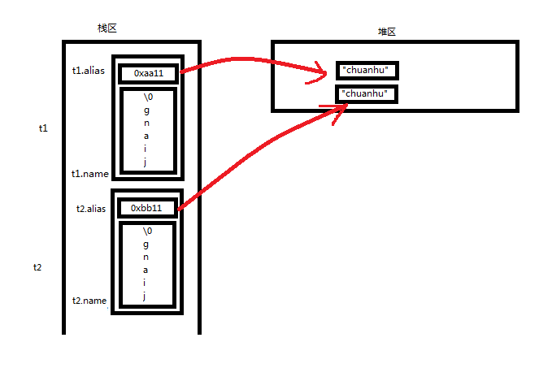

# C语言——结构体专题


<h2 id="0">目录</h2>
<br/>

* [1　结构体类型及结构体变量](#1结构体类型及结构体变量)
	* [1.1　结构体类型及其重命名](#11结构体类型及其重命名)
	* [1.2　结构体类型变量的定义及其初始化](#12结构体类型变量的定义及其初始化)
	* [1.3　结构体类型变量的引用](#13结构体类型变量的引用)
	* [1.4　结构体类型变量的生长方向及大小](#14结构体类型变量的生长方向及大小)
* [2　结构体作函数参数](#2结构体作函数参数)
	* [2.1　结构体变量作函数参数](#21结构体变量作函数参数)
	* [2.2　结构体数组作函数参数](#22结构体数组作函数参数)
* [3　结构体在工程开发中的常见模型](#3结构体在工程开发中的常见模型)
    * [3.1　结构体中套一级指针](#31结构体中套一级指针)
    * [3.2　结构体中套二级指针](#32结构体中套二级指针)
    * [3.3　结构体中套一级指针二级指针的综合应用](#33结构体中套一级指针二级指针的综合应用)
* [4　结构体中的浅拷贝与深拷贝](#4结构体中的浅拷贝与深拷贝)
    * [4.1　结构体中的浅拷贝](#41结构体中的浅拷贝)
    * [4.2　结构体中的深拷贝](#42结构体中的深拷贝)

<br/>


## 1　结构体类型及结构体变量
[回到目录](#0)

### 1.1　结构体类型及其重命名
[回到目录](#0)

> 结构体是一种构造数据类型，用途在于自定义数据类型，把不同类型的数据组合成一个整体。

- **声明结构体数据类型**
```c
struct _Teacher
{
	char  name[32];
	int	  age;
	int   id;
};
//需要注意得是，结构体数据类型是struct _Teacher，而不是struct
```

- **结构体数据类型的重命名**
```c
typedef struct _Student
{
	char  name[32];
	char  sex;
	int	  age;
}Student;
//在进行结构体数据类型的重命名后，结构体数据类型是Student
```

### 1.2　结构体类型变量的定义及其初始化
[回到目录](#0)

> 声明完结构体数据类型，并没有在内存空间上给它分配内存，只有通过结构体类型定义了结构体类型变量，才在内存空间得以给结构体数据类型分配内存

- **１　结构体类型变量的定义主要有三种方式**

```c
//方式一：先声明结构体数据类型，再通过结构体类型定义了结构体类型变量
struct _Teacher
{
	char  name[32];
	int	  age;
	int   id;
};
void main()
{	
	struct _Teacher teacher;
	.....
}

//方式二：声明结构体数据类型的同时，定义结构体类型变量
struct _Teacher
{
	char  name[32];
	int	  age;
	int   id;
}teacher;

//方式三：匿名结构体类型，直接定义结构体类型变量
struct
{
	char  name[32];
	int	  age;
	int   id;
}teacher;
```

- **2　结构体类型变量的初始化主要有三种方式**

```c
//方式一
struct _Teacher
{
	char  name[32];
	int	  age;
	int   id;
};
void main()
{	
	struct _Teacher teacher = {"jiang", 24, 013};
	.....
}

//方式二
struct _Teacher
{
	char  name[32];
	int	  age;
	int   id;
}teacher = {"jiang", 24, 013};

//方式三
struct
{
	char  name[32];
	int	  age;
	int   id;
}teacher = {"jiang", 24, 013};
```

### 1.3　结构体类型变量的引用
[回到目录](#0)

```c
struct _Teacher
{
	char  name[32];
	int	  age;
	int   id;
};
void main()
{	
	struct _Teacher teacher;
	struct _Teacher *pteacher = &teacher;

	//方式一：通过变量法操作结构体
	teacher.age = 24;
	//方式一：通过指针法操作结构体
	pteacher->age = 24;   //编译器翻译pteacher->age为(*pteacher).age即等价于teacher.age
	.....
}
```

### 1.4　结构体类型变量的生长方向及大小
[回到目录](#0)
- **结构体类型变量在栈区是向上生长的**
```c
#include <stdio.h>

typedef struct Teacher
{
	int age;
	int score;
	int name;
}Teacher;

void main()
{	
	Teacher t;
	Teacher *t1 = NULL;

	//绝对位置输出
	printf_s("&(t.age):%p \n", &(t.age));	
	printf_s("&(t.score):%p \n", &(t.score));	
	printf_s("&(t.name):%p \n", &(t.name));	
	printf_s("&t:%p   &t+1:%p \n", &t, &t+1);
	//&(t.age):001FF88C   &(t.score):001FF890   &(t.name):001FF894
	//&t:001FF88C   &t+1:001FF898
	//以4为步长逐渐增大，因此结构体类型变量在栈区是向上生长的

	//相对位置输出
	printf_s("&(t1->age):%d \n", (int)(&(t1->age)));
	printf_s("&(t1->score):%d \n", (int)(&(t1->score)));
	printf_s("&(t1->name):%d \n", (int)(&(t1->name)));
	//&(t1->age):0   &(t1->score):4   &(t1->name):8
	
	return;
}
```
以上结构体类型Teacher在栈区的内存模型图（向上生长）


- **对于C语言中字符型变量的一个奇怪现象**
```c
//C语言中：
char b = 'a';
sizeof(char) = 1;
sizeof(b) = 1;
sizeof('a') = 4;

//C++语言中：
char b = 'a';
sizeof(char) = 1;
sizeof(b) = 1;
sizeof('a') = 1;

//C语言认为'a'是4字节，而C++语言认为'a'是1字节
/*原因如下:
C99标准的规定，'a'叫做整型字符常量(integer character constant)，被看成是int型，所以在32位机器上占4字节。
ISO C++标准规定，'a'叫做字符字面量(character literal)，被看成是char型，所以占1字节。*/
```

- **结构体中各种类型的变量究竟占几个字节**  
int、double、char、char name[7]

<br/>


## 2　结构体作函数参数

[回到目录](#0)

### 2.1　结构体变量作函数参数
[回到目录](#0)

```c
struct _Teacher
{
	char  name[32];
	int	  age;
	int   id;
}Teacher;

void copyStruct(Teacher *to, Teacher *from)
{
	*to = *from;
	.....
}

void main()
{
	Teacher t1, t2;
	t1 = {"jiang", 24, 013};
	
	//直接拷贝
	t2 = t1;
	//间接拷贝（从内存四区的角度去理解）
	copyStruct(&t2, &t1);
	.....
}
```


### 2.2　结构体数组作函数参数
[回到目录](#0)

```c
typedef struct _Student
{
	char  name[14];         
	int	  age;       
}Student;

void creatStruct(Student **st, int num)
{
	Student *temp = NULL;

	.....
	temp = (Student *)malloc(sizeof(Student) * num);
	*st = temp;
}

void printStruct(Student *st, int num)
{
	int i = 0;
	
	.....
	for (i=0; i<num; i++)
		printf_s("%-8s   %-3d \n", st[i].name, st[i].age);
}

void freeStruct(Student **st)
{
	Student *temp = *st;

	.....
	if (temp != NULL)
	{
		free(temp);
		*st = NULL;
	}
}

void main()
{	
	int num = 3;
	int i = 0;
	Student *st = NULL;

	creatStruct(&st, num);
	for (i=0; i<num; i++)
		scanf("%s   %d", st[i].name, &(st[i].age));    //st[i].name已经表示地址了
	printStruct(st, num);
	freeStruct(&st);
}
```

<br/>


## 3　结构体在工程开发中的常见模型
[回到目录](#0)

### 3.1　结构体中套一级指针
[回到目录](#0)
```c
typedef struct _Student
{
	char  name[14]; 
	char  *alias;   //结构体中套一级指针     
	int	  age;       
}Student;

void creatStruct(Student **, int);
void freeStruct(Student **, int);

void main()
{	
	int num = 3;
	int i = 0;
	Student *st = NULL;

	creatStruct(&st, num);
	.....
	freeStruct(&st, num);
}

void creatStruct(Student **st, int num)
{
	int ret = 0;
	int i = 0;
	Student *temp = NULL;

	.....
	//1 创建结构体数组
	temp = (Student *)malloc(sizeof(Student) * num);   
	if (temp == NULL)   //结构体数组创建失败
	{
		ret = -1;
		printf_s("func creatStruct() err:malloc(sizeof(Student) * num) \n");
		goto END;
	}
	memset(temp, 0, sizeof(Student) * num);   
	
	//2 给结构体数组中嵌套的一级指针外挂内存
	for (i=0; i<num; i++)
	{
		temp[i].alias = (char *)malloc(sizeof(char) *14);   
		if (temp[i].alias == NULL)  //结构体数组中嵌套的一级指针外挂内存失败
		{
			ret = -2;
			printf_s("func creatStruct() err:malloc(sizeof(char) *14) \n");
			goto END;
		}
		memset(temp[i].alias, 0, sizeof(char) *14);   
	}

END:
	if (ret != 0)
		freeStruct(&temp, num);
	else
		*st = temp;
}

void freeStruct(Student **st, int num)
{
	int i = 0;
	Student *temp = *st;

	.....
	//结构体数组创建失败
	if (temp == NULL)
		return;
	
	//1 释放结构体数组中嵌套的一级指针外挂内存
	for (i=0; i<num; i++)
	{
		if (temp[i].alias != NULL)
		{
			free(temp[i].alias);
			temp[i].alias = NULL;
		}
	}

	//2 释放位于堆区的结构体数组内存
	if (temp != NULL)
	{
		free(temp);
		*st = NULL;
	}
}


```
**结构体中套一级指针的内存模型，就是在结构体中嵌套的一级指针下挂内存块**


### 3.2　结构体中套二级指针
[回到目录](#0)

```c
typedef struct _Teacher
{
	char  name[12];  
	int   age; 
	char  **stuname;
}Teacher;

void createTeacher(Teacher **, int);
void freeTeacher(Teacher **, int);

void main()
{	
	Teacher *te = NULL;
	int num = 3, i = 0, j = 0;

	createTeacher(&te, num);
	.....
	freeTeacher(&te, num);
}

void createTeacher(Teacher **pte, int num)
{
	Teacher *tmp = NULL;
	int i = 0, j = 0, ret = 0;

	if (pte == NULL)
	{
		printf_s("func createTeacher() err:pte == NULL \n");
		return;
	}

	//1 创建结构体数组
	tmp = (Teacher *)malloc(sizeof(Teacher) * num); 
	if (tmp == NULL)     //结构体数组创建失败
	{
		ret = -1;
		printf_s("func createStruct() err: ret=%d \n", ret);
		goto END;
	}
	memset(tmp, 0, sizeof(Teacher) * num);  

	//2 给结构体中嵌套的二级指针外挂内存块
	for (i=0; i<num; i++)
	{
		tmp[i].stuname = (char **)malloc(sizeof(char *) * num);
		if (tmp[i].stuname == NULL)   //给结构体中嵌套的二级指针外挂内存块失败1
		{
			ret = -2;
			printf_s("func createStruct() err ret=%d \n", ret);
			goto END;
		}
		memset(tmp[i].stuname, 0, sizeof(char *) * num);  

		for (j=0; j<num; j++)
		{
			tmp[i].stuname[j] = (char *)malloc(sizeof(char) * 12);
			if (tmp[i].stuname[j] == NULL)   //给结构体中嵌套的二级指针外挂内存块失败2
			{
				ret = -3;
				printf_s("func createStruct() err ret=%d \n", ret);
				goto END;
			}
			memset(tmp[i].stuname[j], 0, sizeof(char) * 12);  
		}
	}

END:
	if (ret != 0)
		freeTeacher(&tmp, num);
	else
		*pte = tmp;

	return;
}

void freeTeacher(Teacher **pte, int num)
{
	Teacher *p = *pte;
	int i = 0, j = 0;

	if (pte == NULL)   
	{
		printf_s("func freeTeacher() err:pte == NULL \n");
		return;
	}

	//结构体数组创建失败
	if (p == NULL)   
		return;

	//1 释放结构体中嵌套的二级指针所外挂内存块
	for (i=0; i<num; i++)
	{
		for (j=0; j<num; j++)
		{
			if (p[i].stuname[j] !=NULL)
			{
				free(p[i].stuname[j]);
				p[i].stuname[j] = NULL;
			}
		}

		if (p[i].stuname !=NULL)
		{
			free(p[i].stuname);
			p[i].stuname = NULL;
		}
	}

	//2 释放在堆区所嵌套的结构体数组
	if (p != NULL)
	{
		free(p);
		*pte = NULL;
	}

	return;
}
```

**结构体中套二级指针的内存模型，就是在结构体中嵌套的二级指针下挂内存块**


### 3.3　结构体中套一级指针二级指针的综合应用
[回到目录](#0)
> 应用场合：一个老师带有三个学生，老师的信息库用一个结构体来表示，包括老师的姓名（字符数组）、别名（一级指针）、年龄（整型变量）、所带三个学生的信息（二级指针）

```c
#include <stdio.h>
#include <malloc.h>
#include <string.h>

typedef struct _Teacher
{
	char  name[12];  
	char  *aliname;
	int   age; 
	char  **stuname;
}Teacher;

void createTeacher(Teacher **, int);
void sortTeacher(Teacher *, int);
void printTeacher(Teacher *, int);
void freeTeacher(Teacher **, int);

void main()
{	
	Teacher *te = NULL;
	int num = 3, i = 0, j = 0;

	createTeacher(&te, num);

	for (i=0; i<num; i++)
	{
		printf_s("please enter the information of No %d teacher \n", i+1);

		printf_s("please enter Te.name:");
		scanf("%s", te[i].name);

		printf_s("please enter Te.aliname:");
		scanf("%s", te[i].aliname);

		printf_s("please enter Te.age:");
		scanf("%d", &(te[i].age));

		for (j=0; j<num; j++)
		{
			printf_s("please enter Stu.name %d:", j+1);
			scanf("%s", te[i].stuname[j]);
		}

		printf_s("\n");
	}

	sortTeacher(te, num);

	printTeacher(te, num);

	freeTeacher(&te, num);

	return;
}

void createTeacher(Teacher **pte /*out*/, int num)
{
	Teacher *tmp = NULL;
	int i = 0, j = 0, ret = 0;

	if (pte == NULL)
	{
		printf_s("func createTeacher() err:pte == NULL \n");
		return;
	}

	//1 创建结构体数组
	tmp = (Teacher *)malloc(sizeof(Teacher) * num); 
	if (tmp == NULL)     //结构体数组创建失败
	{
		ret = -1;
		printf_s("func createStruct() err: ret=%d \n", ret);
		goto END;
	}
	memset(tmp, 0, sizeof(Teacher) * num);   //结构体数组Teacher te[3]进行0初始化

	//2 给结构体中嵌套的一级指针外挂内存块
	for (i=0; i<num; i++)
	{
		tmp[i].aliname = (char *)malloc(sizeof(char) * 12);  
		if (tmp[i].aliname == NULL)   //给结构体中嵌套的一级指针外挂内存块失败
		{
			ret = -2;
			printf_s("func createStruct() err ret=%d \n", ret);
			goto END;
		}
		memset(tmp[i].aliname, 0, sizeof(char) * 12);   //给结构体中嵌套的一级指针所外挂内存块进行零初始化
	}

	//3 给结构体中嵌套的二级指针外挂内存块
	for (i=0; i<num; i++)
	{
		tmp[i].stuname = (char **)malloc(sizeof(char *) * num);
		if (tmp[i].stuname == NULL)   //给结构体中嵌套的二级指针外挂内存块失败1
		{
			ret = -3;
			printf_s("func createStruct() err ret=%d \n", ret);
			goto END;
		}
		memset(tmp[i].stuname, 0, sizeof(char *) * num);

		for (j=0; j<num; j++)
		{
			tmp[i].stuname[j] = (char *)malloc(sizeof(char) * 12);
			if (tmp[i].stuname[j] == NULL)   //给结构体中嵌套的二级指针外挂内存块失败2
			{
				ret = -4;
				printf_s("func createStruct() err ret=%d \n", ret);
				goto END;
			}
			memset(tmp[i].stuname[j], 0, sizeof(char) * 12);
		}
	}

END:
	if (ret != 0)
		freeTeacher(&tmp, num);
	else
		*pte = tmp;

	return;
}

void sortTeacher(Teacher *te /*in*/, int num)
{
	int i = 0, j = 0;
	Teacher temp;

	if (te == NULL)
	{
		printf_s("func sortTeacher() err:te == NULL \n");
		return;
	}

	//按照字符串name通过选择排序法对结构体数组从小到大排序
	for (i=0; i<num; i++)
	{
		for (j=i+1; j<num; j++)
		{
			if ( strcmp(te[i].name, te[j].name) > 0 )
			{
				temp = te[i];
				te[i] = te[j];
				te[j] = temp;
			}
		}
	}

	return;
}

void printTeacher(Teacher *te /*in*/, int num)
{
	int i = 0, j = 0;

	if (te == NULL)
	{
		printf_s("func printTeacher() err:te == NULL \n");
		return;
	}

	//对齐输出标题栏
	printf_s("Te.name        Te.aliname     Te.age         ");
	printf_s("Stu1.name      Stu2.name      Stu3.name      \n");
	for (i=0; i<num; i++)
	{
		printf_s("%-15s", te[i].name);
		printf_s("%-15s", te[i].aliname);
		printf_s("%-15d", te[i].age);
		for (j = 0; j<num; j++)
		{
			printf_s("%-15s", te[i].stuname[j]);
		}
		printf_s("\n");
	}

	return;
}

void freeTeacher(Teacher **pte /*out*/, int num)
{
	Teacher *p = *pte;
	int i = 0, j = 0;

	if (pte == NULL)   
	{
		printf_s("func freeTeacher() err:pte == NULL \n");
		return;
	}

	//结构体数组创建失败
	if (p == NULL)   
		return;

	//1 释放结构体中嵌套的二级指针所外挂内存块
	for (i=0; i<num; i++)
	{
		for (j=0; j<num; j++)
		{
			if (p[i].stuname[j] !=NULL)
			{
				free(p[i].stuname[j]);
				p[i].stuname[j] = NULL;
			}
		}

		if (p[i].stuname !=NULL)
		{
			free(p[i].stuname);
			p[i].stuname = NULL;
		}
	}

	//2 释放结构体中嵌套的一级指针所外挂内存块
	for (i=0; i<num; i++)
	{
		if (p[i].aliname !=NULL)
		{
			free(p[i].aliname);   
			p[i].aliname = NULL;
		}
	}

	//3 释放在堆区所嵌套的结构体数组
	if (p != NULL)
	{
		free(p);
		*pte = NULL;
	}

	return;
}

/*在Microsoft Visual Studio中的运行结果是：
------------------------------------------
输入部分：
please enter the information of No 1 teacher
please enter Te.name:jiang
please enter Te.aliname:chuan
please enter Te.age:23
please enter Stu.name 1:hu1
please enter Stu.name 2:hu2
please enter Stu.name 3:hu3

please enter the information of No 2 teacher
please enter Te.name:qian
please enter Te.aliname:ying
please enter Te.age:22
please enter Stu.name 1:yu1
please enter Stu.name 2:yu2
please enter Stu.name 3:yu3

please enter the information of No 3 teacher
please enter Te.name:liu
please enter Te.aliname:yi
please enter Te.age:32
please enter Stu.name 1:fei1
please enter Stu.name 2:fei2
please enter Stu.name 3:fei3

输出部分：
Te.name        Te.aliname     Te.age         Stu1.name      Stu2.name      Stu3.name
jiang          chuan          23             hu1            hu2            hu3
liu            yi             32             fei1           fei2           fei3
qian           ying           22             yu1            yu2            yu3
-----------------------------------------*/
```

<br/>


## 4　结构体中的浅拷贝与深拷贝

[回到目录](#0)

### 4.1　结构体中的浅拷贝
[回到目录](#0)
关于结构体中的浅拷贝经常发生在结构体中内嵌指针的情况，我们看以下这个例子。

```c
//结构体中的浅拷贝带来的问题
#include <stdio.h>
#include <string.h>
#include <malloc.h>

typedef struct Teacher
{
	char name[12];
	char *alias;
}Teacher;

void main()
{
	Teacher t1, t2;

	strcpy(t1.name, "jiang");
	t1.alias = (char *)malloc(sizeof(char) * 12);
	strcpy(t1.alias, "chuanhu");

	t2 = t1;   //结构体的直接拷贝

	printf_s("t1.name:%s   t1.alias:%s \n", t1.name, t1.alias);
	printf_s("t2.name:%s   t2.alias:%s \n", t2.name, t2.alias);

	if (t1.alias != NULL)
	{
		free(t1.alias);
		t1.alias = NULL;
	}

	if (t2.alias != NULL)
	{
		free(t2.alias);
		t2.alias = NULL;
	}

	return;
}
```
我们来画一下这个程序的内存模型图


现在我们可以发现以上浅拷贝的问题出现在哪里了！当执行以下代码时：
```c
if (t1.alias != NULL)
{
	free(t1.alias);
	t1.alias = NULL;
}
```
由`t1.alias`在堆区申请的内存已经被释放了。然而在执行`t2 = t1`的拷贝操作时，仅仅是将`t1.alias`其指针值拷贝给`t2.alias`，也就是说，`t1.alias`和`t2.alias`都指向了由`t1.alias`在堆区申请的内存空间，在执行`t2 = t1`的拷贝操作时，并未将由`t1.alias`在堆区申请的内存空间再次在堆区拷贝一份同样的内存空间给`t2.alias`。可是接着执行以下代码时：
```c
if (t2.alias != NULL)
{
	free(t2.alias);
	t2.alias = NULL;
}
```
却将由`t1.alias`在堆区申请的内存空间再释放一次，显然是将由`t1.alias`在堆区申请的内存空间释放了两次，都已经释放了堆区的某块内存空间哪有再释放一次的道理，所以出错了！这也是浅拷贝所带来的问题：仅仅拷贝了一份指针值，并未拷贝一份指针所指向的内存空间！为了解决这个问题一种方法是，将以下代码
```c
if (t2.alias != NULL)
{
	free(t2.alias);
	t2.alias = NULL;
}
```
改成以下代码即可（即释放一次就够了，千万别释放两次）
```c
if (t2.alias != NULL)
{
	//删除：free(t2.alias);
	t2.alias = NULL;   //避免出现野指针
}   
```
当然第二种处理办法就是实现结构体的深拷贝！


### 4.2　结构体中的深拷贝
[回到目录](#0)
关于结构体中的深拷贝是相对于以上的浅拷贝而言的。上述的浅拷贝仅仅拷贝了指针，并未拷贝指针所指向的内存空间；而结构体中深拷贝，不仅仅拷贝指针，也拷贝指针所指向的内存空间。我们看以下例子（相对于浅拷贝例子的微改进）
```c
#include <malloc.h>

typedef struct Teacher
{
	char name[12];
	char *alias;
}Teacher;

void main()
{
	Teacher t1, t2;

	strcpy(t1.name, "jiang");
	t1.alias = (char *)malloc(sizeof(char) * 12);
	strcpy(t1.alias, "chuanhu");

	t2 = t1;   //直接拷贝
	t2.alias = (char *)malloc(sizeof(char) * 12);
	strcpy(t2.alias, t1.alias);

	printf_s("t1.name:%s   t1.alias:%s \n", t1.name, t1.alias);
	printf_s("t2.name:%s   t2.alias:%s \n", t2.name, t2.alias);

	if (t1.alias != NULL)
	{
		free(t1.alias);
		t1.alias = NULL;
	}

	if (t2.alias != NULL)
	{
		free(t2.alias);
		t2.alias = NULL;
	}

	return;
}
```
我们来画一下这个程序的内存模型图
  
显然可见，结构体中的深拷贝，不仅仅拷贝指针，也拷贝指针所指向的内存空间。
